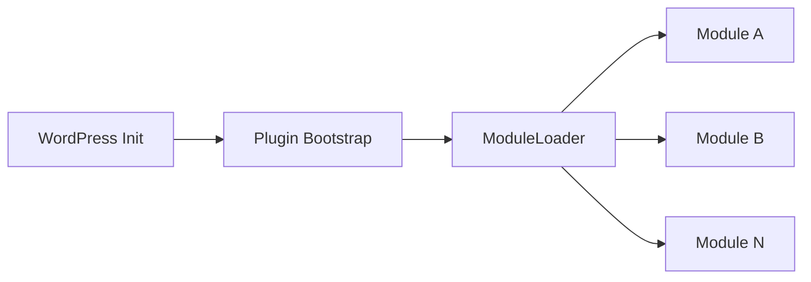

# معماری فنی و ساختار ماژولار افزونه

این سند ساختار معماری، قراردادهای نرم‌افزاری و الگوهای توسعه داخلی افزونه را برای توسعه‌دهندگان ارشد تشریح می‌کند.

---

## ۱. چرخه حیات و بارگذاری (Lifecycle & Bootstrapping)

افزونه از الگوی معماری ماژولار مبتنی بر `ModuleInterface` و `ModuleLoader` استفاده می‌کند:

- **کلاس اصلی:** `src/Core/Plugin.php` وظیفه راه‌اندازی و تزریق وابستگی‌ها را بر عهده دارد.
- **ماژول‌ها:** هر ماژول در مسیر `src/Modules/{ModuleName}/` مستقر بوده و مستقل از سایر ماژول‌ها عمل می‌کند.

---

## ۲. قلاب‌ها و فیلترها (Hooks & Contracts)

تمامی اکشن‌ها و فیلترهای افزونه دارای پیشوند یکتا (`{{hookPrefix}}`) هستند:

- `{{hookPrefix}}_loaded`: پس از بارگذاری موفق تمام ماژول‌ها شلیک می‌شود.
- `{{hookPrefix}}_settings_saved`: پس از اعتبارسنجی و ذخیره تنظیمات ارسال می‌شود.

---

## ۳. امنیت و اعتبارسنجی دوگانه (Two-Gate Defense)

در تمام پردازش‌های Ajax و REST، دفاع دوگانه پیاده‌سازی شده است:

1. **بررسی اصالت (Origin / Nonce):** جلوگیری از حملات CSRF.
2. **بررسی سطح دسترسی (Privilege / Capability):** بررسی مستقیم `current_user_can()`.
