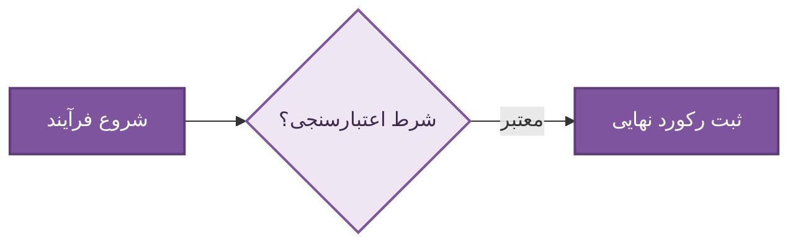

# ۱. [عنوان بخش یا پنل]

این راهنما مراحل گام‌به‌گام کارکرد، تنظیمات و مدیریت بخش [نام بخش] را در پیشخوان وردپرس شرح می‌دهد.

---

## ۱. راهنمای گام‌به‌گام و نحوه استفاده

برای کار با این بخش:

1. در پیشخوان وردپرس، از منوی کناری به مسیر **[نام منوی والد] > [نام صفحه]** بروید.
2. فیلدها و گزینه‌های مورد نظر را بر اساس نیاز کسب‌وکار تکمیل نمایید.
3. بر روی دکمهٔ **«ذخیره تغییرات»** کلیک فرمایید.

::: note
توضیح کوتاه و نکته کلیدی در رابطه با دسترسی، کش یا الزامات اولیه این بخش.
:::

---

## ۲. جدول تنظیمات و فیلدها

| نام فیلد / گزینه | مقدار پیش‌فرض | توضیحات و اثر عملیاتی                       |
| :--------------- | :-----------: | :------------------------------------------ |
| `[شناسه_گزینه]`  |   `[مقدار]`   | شرح سرراست و مختصر کارکرد این فیلد در سیستم |

---

## ۳. ضوابط و هشدارهای مهم

::: warning
هشدار بحرانی عملیاتی (مانند عدم حذف داده‌های مشتریان، ریست نشدن تنظیمات، یا تداخل درگاه‌ها).
:::

