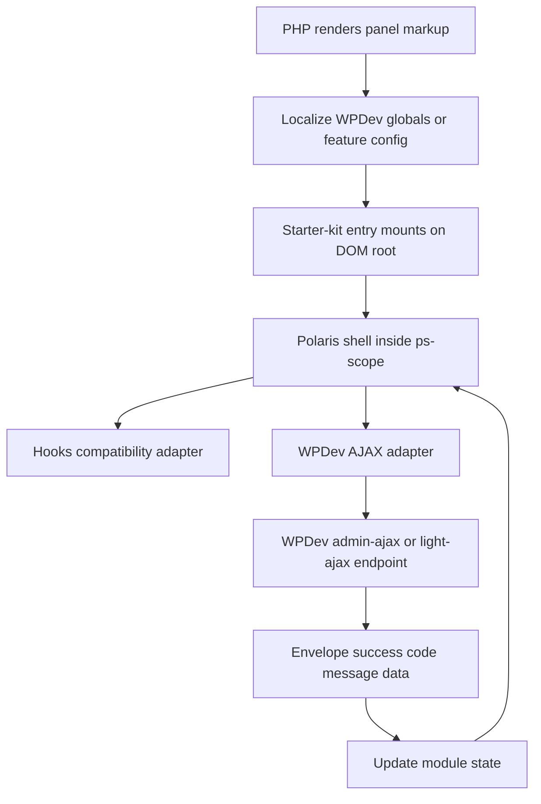

# WPDev x Polaris Integration Plan

## Goal

Coordinate WPDev's existing frontend JavaScript and AJAX model with `wp-starter-kit` when `frontendStack: polaris` is enabled, using an adapter-first approach rather than a full UI rewrite.

This plan assumes:

- Existing WPDev panel/frontend markup should remain usable.
- State and AJAX behavior should progressively move toward module-based JS entries in `wp-starter-kit`.
- Polaris should act as the UI shell and design system around existing flows.
- This applies broadly to WPDev panels, with checkout as the clearest reference implementation.

## Scope Decision

Chosen direction:

- Integration mode: adapter/wrap, not full React/Preact rewrite
- Scope: general strategy for all panels
- Reference flow: checkout/cart because it exercises the hardest nonce and light-AJAX behavior

## Current WPDev Frontend Model

## Script loading and global state

WPDev currently uses PHP-registered scripts and localized globals rather than module-first frontend entries.

Key references:

- `wpdev/modules/core/src/class-scripts.php`
- `wpdev/modules/core/assets/js/wpdev-ajax.js`
- `wpdev/modules/core/assets/js/functions/functions-core.js`
- `wpdev/modules/field-builder/assets/js/vue-apps.js`

Important observations:

- Scripts are registered centrally from PHP.
- Shared globals are exposed through `wp_localize_script()`.
- Existing frontend code expects browser globals like `wpdev_ajax`, `wpdev_settings`, `wpdev_checkout`, and WordPress `wp.hooks`.
- WPDev frontend behavior is a mix of jQuery, Vue-era components, and WordPress hooks.

## AJAX model

WPDev already has a shared AJAX client:

- `wpdev/modules/core/assets/js/wpdev-ajax.js`

Capabilities:

- `window.wpdev.ajax.post(action, data, options)`
- `window.wpdev.ajax.get(action, data, options)`
- Supports admin AJAX and light AJAX endpoint selection
- Injects the standard WPDev AJAX nonce (`wpdev-ajax-nonce`) into payloads as `nonce`
- Normalizes responses into a standard envelope

Expected envelope:

```json
{
  "success": true,
  "code": "success",
  "message": "",
  "data": {}
}
```

Server-side shape reference:

- `wpdev/modules/core/src/ajax/class-ajax-response.php`

## Hook model

WPDev relies on WordPress hooks on the frontend:

- `wp.hooks`
- `doAction`
- `applyFilters`
- per-feature hook names such as `wpdev_on_create_order`

Examples:

- `wpdev/modules/field-builder/assets/js/vue-apps.js`
- `wpdev/modules/table-builder/assets/js/list-tables/list-tables-hooks.js`

This matters because any Polaris-based shell must either:

- use the same hook surface directly, or
- provide a compatibility layer that preserves those frontend extension points

## Checkout as the reference integration case

Checkout is the most important reference because it uses:

- localized feature-specific globals
- light AJAX
- feature-specific nonce verification
- dynamic state updates
- frontend hook chaining

Key file:

- `wpdev-examples/checkout/src/checkout/class-checkout.php`

Important facts from checkout:

- localized vars include:
  - `ajaxurl`
  - `late_ajaxurl`
  - `baseurl`
  - `nonce`
- `create_order()` validates `_wpnonce` or `nonce` against `wpdev_checkout`
- checkout uses light AJAX endpoints for `wpdev_create_order` and related actions
- frontend code must not assume `results.data` always exists on failure

This means checkout cannot be treated as a generic `wpdev.ajax` consumer without a feature-specific adapter.

## Polaris and wp-starter-kit Model

## Polaris rules that affect integration

Relevant sources:

- `wp-starter-kit/packages/polaris-stack/README.md`
- `wp-starter-kit/packages/polaris-stack/context.md`
- `wp-starter-kit/docs/polaris/starter.md`
- `wp-starter-kit/skills/wpdev-js-modules/SKILL.md`

Non-negotiable Polaris rules:

- wrap UI in `.ps-scope`
- layout and style stay separate
- theme is CSS-token driven
- theme switching uses `data-theme`
- initialize theme before first paint with `createPolarisThemeInitScript()`
- do not force a React-only architecture

## Starter-kit JS module model

Relevant sources:

- `wp-starter-kit/docs/module-guide.md`
- `wp-starter-kit/docs/build-system.md`
- `wp-starter-kit/docs/architecture.md`
- `wp-starter-kit/skills/wpdev-js-modules/SKILL.md`

Expected structure:

```text
src/Modules/{Feature}/assets/entries/{entry}.ts(x)
  -> assets/bundles/{Feature}-{entry}.js
```

Shared package ecosystem:

- `@wpdev/polaris-stack`
- `@wpdev/hooks`
- `@wpdev/utils`
- `@wpdev/rest-utils`

Starter-kit assumes:

- frontend/admin behavior should be feature-owned
- JS should mount on explicit DOM roots
- shared runtime behavior should live in reusable packages or deps bundles

## Integration Strategy

## High-level approach

Do not rewrite WPDev panels immediately.

Instead:

1. Keep existing WPDev PHP rendering and business endpoints.
2. Introduce starter-kit module entries as thin integration shells.
3. Let Polaris provide wrapper layout, theming, and progressive UI composition.
4. Keep AJAX contracts and hook contracts compatible during migration.

## Adapter layers to introduce

### 1. AJAX adapter

Introduce a small adapter in starter-kit that wraps WPDev transport differences behind one frontend contract.

Responsibilities:

- choose `admin-ajax` vs light AJAX correctly
- inject the correct nonce field
- normalize every response to `{ success, code, message, data }`
- never allow consumers to assume `results.data` exists
- expose a consistent Promise-based API

Suggested contract:

```ts
type WpdevAjaxEnvelope<T = unknown> = {
  success: boolean;
  code: string;
  message: string;
  data: T | null;
};

type WpdevAjaxOptions = {
  transport?: "admin" | "light";
  endpointUrl?: string;
  nonceField?: "_wpnonce" | "nonce";
  nonceValue?: string;
};
```

Default behavior:

- Prefer the shared WPDev client when available:
  - `window.wpdev.ajax.post/get`
- If wrapping that client, keep the same envelope semantics.

Feature exception:

- Checkout must override nonce behavior and always merge the checkout nonce into payload objects when calling light-AJAX handlers like `wpdev_create_order`.

### 2. Localize/config adapter

Starter-kit entries must receive WPDev globals in a predictable shape.

Instead of letting each module read arbitrary browser globals directly, define a mapping layer such as:

```ts
type WpdevFeatureConfig = {
  ajax?: {
    adminUrl?: string;
    lightUrl?: string;
    nonce?: string;
  };
  checkout?: {
    baseurl?: string;
    nonce?: string;
    lateAjaxUrl?: string;
  };
  hooksNamespace?: string;
};
```

This lets starter-kit entries consume a stable config object while legacy WPDev PHP can continue localizing old globals.

### 3. Hooks compatibility adapter

Preserve WPDev extensibility by keeping a hook bridge available.

Requirements:

- support `doAction`
- support `applyFilters`
- continue using WordPress-style hook names where panels already depend on them

Recommended direction:

- Use the starter-kit hooks bridge as the stable consumer API.
- Map it to WordPress `wp.hooks` where WPDev already expects that ecosystem.
- Do not silently remove existing frontend extension points during migration.

## Runtime Flow



## Rollout Plan

## Phase 1: Establish shared contracts

Before migrating any individual panel:

- define the AJAX adapter contract
- define the localize/config contract
- define the hook compatibility contract
- define guardrails for failed AJAX responses

This phase should not change UI behavior yet.

## Phase 2: Checkout reference integration

Use checkout as the proving ground because it exercises the hardest cases.

Checklist:

- preserve existing checkout PHP rendering
- mount a starter-kit module entry on top of the current flow
- route `create_order` and related actions through the new adapter
- inject checkout nonce explicitly
- preserve hook actions such as order-created/update hooks
- ensure failure states do not read nested `data` blindly

Success criteria:

- no regression in `wpdev_create_order`
- no regression in `wpdev_render_field_template`
- no regression in theme/base URL behavior

## Phase 3: Generalize for all panels

For each panel/module:

1. classify its transport type
   - admin AJAX
   - light AJAX
   - REST
2. identify required nonce source
3. identify existing localized globals
4. identify frontend hook usage
5. add only the minimum Polaris wrapper needed
6. move interaction logic to starter-kit entry modules progressively

## Panel Audit Matrix

Each candidate panel should be reviewed against this matrix:

- DOM root already exists or must be added
- current JS entrypoint type:
  - jQuery
  - Vue-era
  - mixed
  - none
- transport:
  - admin AJAX
  - light AJAX
  - REST
- nonce policy:
  - shared `wpdev-ajax-nonce`
  - feature-specific nonce
  - custom
- localized globals present
- frontend hook dependencies
- whether `.ps-scope` can wrap only the mount region

## Risks and Constraints

## Main risks

- treating checkout as a generic AJAX flow when it has feature-specific nonce semantics
- losing existing `wp.hooks` extension points
- duplicating state between legacy JS and starter-kit entries
- wrapping too much of a page in Polaris and unintentionally clobbering existing admin/frontend styling
- assuming all panels can move to the same transport model

## Important constraints

- adapter-first means old and new runtimes may coexist for a while
- response guards are mandatory
- localization shape drift must be controlled
- Polaris should be introduced as a scoped shell, not a page-wide reset

## Verification Checklist

Minimum validation per migrated panel:

- JS mounts only when the expected DOM root exists
- `.ps-scope` is applied only to the intended region
- localized config contains the expected URLs and nonce values
- AJAX failure paths do not assume `data` is present
- existing frontend hook callbacks still fire

Checkout-specific validation:

- `wpdev_render_field_template` succeeds with the expected nonce
- `wpdev_create_order` succeeds through light AJAX
- failed order responses do not trigger `results.data.order` errors
- state updates still propagate to dependent UI pieces

## Recommendation

The safest implementation path is:

1. define starter-kit-side adapters first
2. validate the pattern with checkout
3. document transport and nonce rules per panel type
4. then expand to the broader WPDev panel set

Do not start with a full Polaris UI rewrite.
Do not start by replacing all legacy globals.
Do not unify all AJAX paths prematurely.

---

## Implementation Status

Last updated: 2026-07-27

### Phase 1 — shared contracts (done)

Package: [`packages/wpdev-bridge`](packages/wpdev-bridge/) (`@wpdev/wpdev-bridge`)

| Adapter | API                                                                                                                                   |
| ------- | ------------------------------------------------------------------------------------------------------------------------------------- |
| AJAX    | `createWpdevAjax`, `createCheckoutAjax`, `createListTableAjax`, `unwrapListTablePayload`, `normalizeEnvelope`, `hasData`, `withNonce` |
| Config  | `readWpdevFeatureConfig`, `isCheckoutAjaxReady`                                                                                       |
| Hooks   | `getWpdevHooks`, `doWpdevAction`, `applyWpdevFilters`                                                                                 |

Tests: `tests/packages/wpdev-bridge.test.js` (13 passing).

### Phase 2 — checkout reference (done, adapter-aligned)

| Piece                              | Location                                                                                                           |
| ---------------------------------- | ------------------------------------------------------------------------------------------------------------------ |
| Reference entry docs               | [`docs/wpdev-bridge-checkout.md`](docs/wpdev-bridge-checkout.md)                                                   |
| Legacy checkout envelope normalize | `wpdev-examples/checkout/assets/js/checkout/checkout-core.js` → `normalize_ajax_envelope` + guarded `create_order` |
| Checkout nonce + early boot        | already on `main` (`fd13960` and prior)                                                                            |

### Phase 3 — generalize (docs seeded)

| Piece              | Location                                                               |
| ------------------ | ---------------------------------------------------------------------- |
| Panel audit matrix | [`docs/wpdev-panel-audit-matrix.md`](docs/wpdev-panel-audit-matrix.md) |
| Package map        | `skills/wpdev-js-modules/references/packages-map.md`                   |

### Phase 3.1 — admin AJAX panels (done)

Next transport class after checkout light-AJAX: **admin-ajax + custom/shared nonce**.

| Piece                                            | Location                                                                   |
| ------------------------------------------------ | -------------------------------------------------------------------------- |
| `createListTableAjax` / `unwrapListTablePayload` | `packages/wpdev-bridge/ajax.js`                                            |
| List-table reference                             | [`docs/wpdev-bridge-list-tables.md`](docs/wpdev-bridge-list-tables.md)     |
| Legacy list-table envelope guards                | `wpdev/modules/table-builder/assets/js/list-tables/list-tables-factory.js` |
| Settings ajax_button fallback harden             | `wpdev/modules/field-builder/views/settings/fields/field-ajax_button.php`  |

Next incremental work: Vue-era admin apps / customizer hooks, or scaffold a real
Polaris `CheckoutShell` module entry that imports `@wpdev/wpdev-bridge`.
