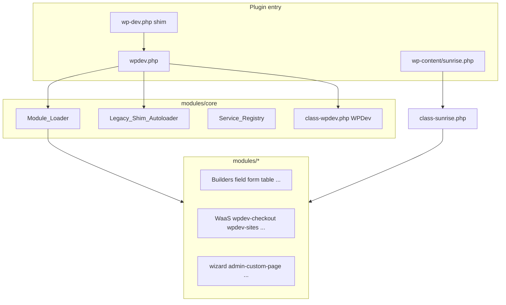

# WPDev — AI project context (modularization)

> **Purpose of this file:** Hand this document to another AI assistant so it understands what WPDev is, why the codebase was restructured, how it works today, and what rules to follow.  
> **Audience:** LLMs, code agents, onboarding developers.  
> **Last updated for release:** 2.6.0 (builder platform extraction; Phase 2.9 + post-2.5 builders).  
> **Repository:** https://github.com/abolfazl-moeini/wpdev-core

---

## Executive summary (team)

**WPDev** is a WordPress plugin (preferably **network multisite**) for building a **WaaS** (Website as a Service) platform: products, subscriptions, checkout, customer sites, domains, email, broadcasts, and network admin.

**Our goal:** migrate a legacy **monolith** under `inc/` to a **modular** architecture under `modules/` without breaking public APIs and legacy namespaces (`WPDev\`, `WPDevFramework\Admin_Pages\`, …).

**Current state (2.8.0 — builder platform + examples split):**

- Runtime code lives under `modules/` (framework) and `examples/` (optional domains); `inc/` is PHP-free (Phase 2.9).
- **Builder DAG:** `table-builder` → `core` + `tab-navigation` only (not `admin-page-builder`); `wpdev_render_empty_state()` in `core`.
- **AJAX:** register with `wpdev_register_ajax_handler()`; standard responses via `wpdev_ajax_success()` / `wpdev_ajax_error_*`; shared client `wpdev-ajax.js`.
- **Fields:** `wpdev_field_view( $context, $type )`; contexts: `settings`, `admin`, `checkout`.
- **Settings:** `Settings_Storage` + `Settings_Save`; `Settings_Section_Registry`.
- **Component registry:** `WPDevFramework\Core\Component_Registry` + trait across builders.
- **API docs:** colocated `API_DOC.md` + generated index under `docs/api/`.
- **Agent skill:** [`skills/wpdev-panel-builder/SKILL.md`](../skills/wpdev-panel-builder/SKILL.md) — build admin panels (also at `.cursor/skills/wpdev-panel-builder/`).
- Regression: `composer ci`, `composer test`, `composer regression:docker`.

**What AI must not do:** move code back to `inc/`, break removed shims, or edit `docs/modularization/phase-2-execution-plan.md` unless the user explicitly asks.

---

## 1. What this project is

| Item | Detail |
|------|--------|
| **Name** | WPDev |
| **Type** | WordPress plugin (`wpdev.php` bootstrap; folder often `wp-content/plugins/wpdev/`) |
| **Domain** | WaaS platform builder — network admin, customer sites, billing, domains, templates |
| **PHP** | >= 7.4.30 |
| **WordPress** | Multisite network admin is first-class; sunrise.php for early boot (domain mapping) |
| **Version (modularization release)** | **2.5.0** |

WPDev is **not** a generic theme or a small utility plugin. It is a large admin framework plus many domain subsystems (checkout, payments, sites, emails, etc.) with shared builders (fields, forms, tables, settings panels).

---

## 2. What we wanted (the modularization goal)

### Problem (before ~2.4 / 2.5)

- Most PHP lived under **`inc/`** in a flat/monolith layout (`inc/admin-pages/`, `inc/checkout/`, `inc/class-*.php`, …).
- Hard to reason about dependencies, test in isolation, or enable/disable domain features.
- Duplicated boot paths and tight coupling to a single `class-wpdev.php` monolith.

### Goal

1. **Physical modularization:** move canonical code into **`modules/<module-id>/`** with `setup.php` per module.
2. **Stable public API:** keep legacy class names (`WPDevFramework\Admin_Pages\Product_List_Admin_Page`, etc.) via autoload maps, not via permanent `inc/` copies.
3. **Phased removal of shims:** Phase 2.9 removed all `inc/**/*.php` delegator files (~259 files).
4. **Automated gates:** smoke, audits, PHPUnit, Docker wp-load, `composer release:gate`.
5. **Multisite safety:** sunrise auto-upgrade to `modules/wizard/class-sunrise.php` paths.

### Non-goals (unless explicitly requested)

- Rewriting all business logic or UI from scratch.
- Changing WordPress core behavior.
- Removing legacy hooks (`wpdev_init`, `wpdev_load`, …) — aliases preserved.

---

## 3. Architecture today (after 2.5.0)

### High-level diagram



### Bootstrap order (simplified)

1. WordPress loads **`wpdev.php`** (or legacy **`wp-dev.php`** which only `require`s `wpdev.php`).
2. `constants.php`, Composer `autoload.php`, `Module_Autoloader`, `Legacy_Shim_Autoloader`, `trait-singleton`, **`modules/core/src/class-wpdev.php`** (global `WPDev` class).
3. `modules/core/setup.php` registers core module; on `plugins_loaded` → `Module_Loader::load_all(modules/)`.
4. `Examples_Loader` loads enabled `examples/*` on `wpdev_modules_loaded` (optional domains).
5. Each `modules/*/setup.php` or `examples/*/setup.php` calls `Module_Loader::register()` / example registration and hooks (`wpdev_init`, `wpdev_load`, `wpdev_admin_pages`, …).
6. `WPDev::get_instance()` runs `init()` when requirements + **`wpdev_setup_finished`** allow full load.
7. Domain admin pages register via **`wpdev_register_module_admin_pages()`** in each `examples/*/setup.php` (not the old monolith list by default).

### The `modules/` tree (14 framework modules)

| Layer | Module IDs | Role |
|-------|------------|------|
| **Core** | `core` | Loader, services, managers, REST, country data, legacy boot split under `src/legacy/` |
| **Builders** | `field-builder`, `form-builder`, `settings-panel-builder`, `menu-builder`, `admin-page-builder`, `tab-navigation`, `table-builder`, `metabox-builder`, `admin-widget-builder` | Reusable admin UI / CRUD framework |
| **Examples / tools** | `admin-custom-page`, `admin-setting-page`, `wizard` | Dashboard/settings examples, setup wizard, **Sunrise** |

### The `examples/` tree (optional)

| Layer | Paths | Role |
|-------|-------|------|
| **WaaS domain** | `examples/*` (19 modules) | Business domains; delete-safe; each has `setup.php` + `src/` |
| **Playground** | `examples/playground-*` | Dev-only demo panels (`WPDEV_PLAYGROUND_RUN`) |
| **Other demos** | `metabox-post-type`, `wp-panel-examples`, … | Optional sample integrations |

Typical module layout:

```text
examples/checkout/
  setup.php              # Module_Loader::register + hooks
  README.md
  src/
    checkout/            # Canonical PHP (namespaces WPDevFramework\Checkout\...)
    admin/
    tables/
  assets/                # Optional
  views/                 # Optional
```

### What happened to `inc/`

| Before | After 2.5.0 |
|--------|-------------|
| All runtime PHP | **No PHP** — only `inc/README.md`, `inc/next/phpcs.xml` |
| `inc/functions/*.php` shims | **`wpdev_public_function_map()`** in `modules/core/src/functions/module-require.php` |
| `inc/class-*.php` shims | **`Legacy_Shim_Autoloader`** + early `require` of `class-wpdev.php` |
| `inc/api/schemas/` | `modules/core/src/api/schemas/` |

**Do not add new files under `inc/` for runtime code.**

### Legacy class loading

- **`WPDevFramework\Core\Legacy_Shim_Autoloader`:** maps legacy FQCNs (`WPDevFramework\Admin_Pages\*`, `WPDevFramework\Checkout\*`, …) to files under `modules/`.
- **`WPDevFramework\Autoloader`:** PSR-like loader for `WPDev\*` under **`modules/core/src`** (not `inc/`).
- **Composer:** dependencies under `dependencies/`; some classmaps point at `modules/core/src`.

### Key hooks (lifecycle)

| Hook | When |
|------|------|
| `wpdev_init` | Early module setup |
| `wpdev_load` | After requirements; managers, components |
| `wpdev_register_forms` | Forms / modals |
| `wpdev_admin_pages` | Admin page registration (legacy hook name; modules use helpers) |
| `wpdev_modules_loaded` | All modules bootstrapped |
| `wpdev_register_module_admin_pages` | Per-module admin page classes |

### Important filters

| Filter | Default | Use |
|--------|---------|-----|
| `wpdev_load_monolith_admin_pages` | `false` | Emergency rollback: load old monolith page list from `modules/core/src/legacy/load-monolith-admin-pages.php` |
| `wpdev_module_enabled` | `true` | Disable a domain module’s admin UI |
| `wpdev_module_enabled` | (via bridge) | Legacy filter name still honored for `wpdev-*` module ids |

---

## 4. Multisite / sunrise (critical for WaaS)

- **`sunrise.php`** (plugin root) must be copied to **`wp-content/sunrise.php`** when `SUNRISE` is true.
- **`WPDEV_SUNRISE_VERSION`** is **2.5.0**; `Sunrise::manage_sunrise_updates()` copies the plugin file when the content copy is older.
- Canonical class: **`modules/wizard/class-sunrise.php`** (not `inc/class-sunrise.php` — removed).

---

## 5. Directory map (repository root)

```text
wpdev/
  wpdev.php                 # Main plugin bootstrap (canonical)
  wp-dev.php                # Back-compat shim → wpdev.php
  constants.php             # WPDEV_VERSION, paths
  autoload.php              # Composer
  sunrise.php               # Multisite early boot (copy to wp-content)
  modules/                  # Framework modules (required)
  examples/                 # Optional WaaS domains + playground demos
  skills/                   # Agent skills (wpdev-panel-builder)
  inc/                      # Legacy shell only (no PHP)
  bin/                      # smoke, audits, regression, profile
  tests/unit-tests/         # PHPUnit (mirror modules layout)
  docs/modularization/      # Inventories, migration, this file
  lang/                     # gettext; #: paths point to modules/ and examples/
  dependencies/             # Vendor (scoped WPDevFramework\Dependencies\...)
  assets/ views/            # Shared static / templates
```

---

## 6. Phases completed (execution plan mapping)

Use this when the user asks “which phase is done?”:

| Phase | Description | Status for 2.5.0 |
|-------|-------------|------------------|
| **J** | Core extraction (loader, services, bootstrap split) | Done |
| **K** | Builders (field, form, settings, admin-page, table, …) | Done (in scope) |
| **L** | Physical move of WaaS domains to `examples/*` | **Done (2.8.0)** |
| **M** | Small moves / cleanup | Mostly done |
| **N** | Blockers (ajax, gateway, caps, screen options) | Done |
| **O** | Assets co-location with modules | Done in scope |
| **P** | Tests + regression (`composer ci`, Docker, P2) | Done (automated) |
| **2.9** | Remove all `inc/**/*.php` shims | **Complete** |
| **P3** | Performance (abort xhr, single wpdev-vue, module load timing) | Baseline + audit; production profiling optional |
| **0** | Builder DAG (empty-state → core) | Done (2.6.0) |
| **J** (post-2.5) | `wpdev.ajax`, tab loader, modal ajax, screen-options panel | Done (2.6.0) |
| **K1–K4, K6, K8** | Field resolver, settings split, menu/templates, metabox registry, core Component_Registry | Done (2.6.0) |

**Not required for 2.5.0 tag but may remain:** manual browser QA, HTTP regression with password, tightening `p3-baseline.json` on production hardware.

**2.6.0 follow-ups (optional):** migrate remaining custom `wp_send_json()` shapes (tax save, webhooks, membership polling); envelope all checkout editor ajax; manual P2 in browser with DB.

---

## 7. Commands agents should know

```bash
# No WordPress needed
composer ci

# Full pre-release (needs wp-load.php on disk or Docker)
composer release:gate
RUN_DOCKER=1 composer pre-release
WPDEV_DOCKER_ENSURE_SETUP=1 composer regression:docker

# Audits
composer audit:inc-complete
composer audit:sunrise
composer profile:modules   # inside WP / Docker

# Docs generation
composer docs:generate
```

---

## 8. Rules for AI assistants working in this repo

1. **Canonical code path:** `modules/<name>/src/...` — never reintroduce `inc/` PHP.
2. **New features:** add or extend a module; register in `setup.php`; declare `dependencies` in `Module_Loader::register`.
3. **Legacy class names:** keep existing FQCNs; extend `Legacy_Shim_Autoloader` scan roots only if necessary.
4. **Public functions:** add to `wpdev_public_function_map()` in `module-require.php`, not new `inc/functions/` files.
5. **Do not edit** `docs/modularization/phase-2-execution-plan.md` unless the user explicitly asks (team rule).
6. **Commits:** only when the user asks to commit.
7. **Multisite tests:** prefer `composer regression:docker`; set `wpdev_setup_finished` or `WPDEV_DOCKER_ENSURE_SETUP=1` for admin menu tests.
8. **Main file:** refer to **`wpdev.php`**; `wp-dev.php` is compatibility only.

---

## 9. Related documentation (read order)

| File | Content |
|------|---------|
| [`skills/wpdev-panel-builder/SKILL.md`](../skills/wpdev-panel-builder/SKILL.md) | Agent skill: build admin panels |
| [migration-guide.md](./migration-guide.md) | Commands, Docker, sunrise upgrade |
| [release-2.5.0-notes.md](./release-2.5.0-notes.md) | Release summary |
| [regression-signoff.md](./regression-signoff.md) | P2 checklist |
| [changelog.md](./changelog.md) | Detailed change log |
| [modules/README.md](../../modules/README.md) | Module list and boot |
| [modules/core/README.md](../../modules/core/README.md) | Core loader and shims |
| `docs/modularization/*-inventory.md` | Hooks, admin pages, tables (generated) |

---

## 10. Mental model for “where does X live?”

| Looking for… | Look in… |
|--------------|----------|
| Plugin bootstrap | `wpdev.php`, `modules/core/setup.php` |
| Global `WPDev` class | `modules/core/src/class-wpdev.php` |
| Admin list/edit pages | `examples/*/src/admin/` or builders |
| Checkout / cart | `examples/checkout/src/checkout/` |
| REST schemas | `modules/core/src/api/schemas/` |
| List tables | `modules/table-builder/`, `examples/*/src/tables/` |
| Fields / forms | `modules/field-builder/`, `modules/form-builder/` |
| Field view path | `wpdev_field_view( 'settings' \| 'admin' \| 'checkout', $type )` |
| AJAX register / respond | `wpdev_register_ajax_handler()`, `wpdev_ajax_success()` — see [architecture-contracts.md](./architecture-contracts.md) |
| Domain mapping / sunrise | `modules/wizard/` |
| Country data | `modules/core/src/country/` |
| Autoload map | `modules/core/src/class-legacy-shim-autoloader.php` |
| Deprecated APIs list | `modules/core/src/deprecated/deprecated-apis.md` |

---

## 11. One-paragraph elevator pitch (English)

WPDev is a large WordPress multisite plugin that powers a Website-as-a-Service control plane. The codebase was migrated from a monolithic `inc/` tree to **33 self-contained modules** under `modules/`, loaded by a dependency-aware **`Module_Loader`**, while **legacy PHP class names remain valid** through **`Legacy_Shim_Autoloader`**. Release **2.5.0** completes Phase 2.9 (zero `inc/` PHP shims), fixes bootstrap via **`wpdev.php`**, and ships automated regression tooling for CI and Docker.

---

*When in doubt, run `composer ci` and read `bin/smoke-modularization.php` for invariants.*
