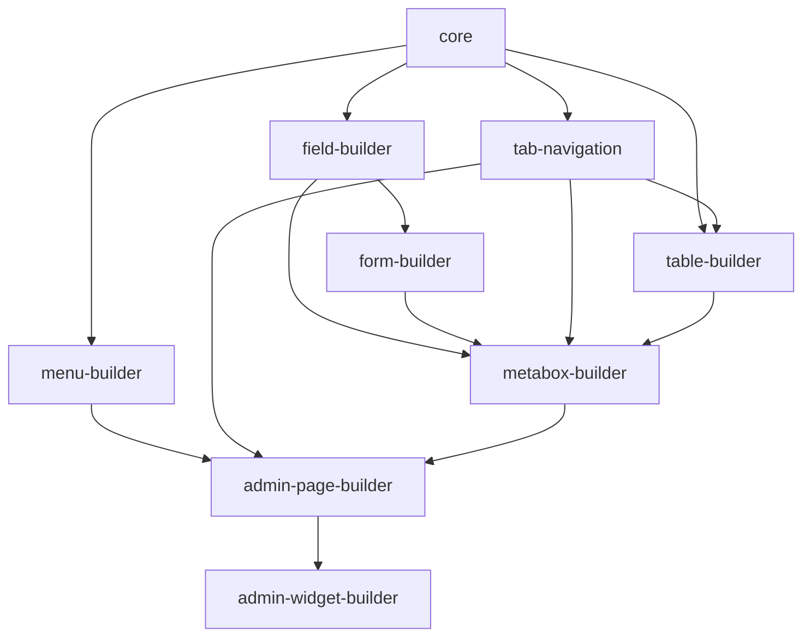

# Architecture Contracts (Phase B)

## Module_Contract

Every module exposes `setup.php` and optionally implements `WPDevFramework\Core\Contracts\Module_Contract`.

## Service_Registry

Core services: `ajax`, `modal`, `form`, `screen_options`, `tour`, `view`.

Access via `wpdev_services( 'ajax' )`.

## Component_Registry (K8)

`WPDevFramework\Core\Component_Registry` is the shared store. Every builder module’s
`Component_Registry` uses `WPDevFramework\Core\Traits\Delegates_Component_Registry` and
fires `wpdev_{builder-slug}_register` via `Component_Registry::init( $module_id )`.

`Metabox_Registry` (K6-01) is the formal registry for edit-screen widget
definitions (`wpdev_metabox_register`).

## Hook lifecycle

| Phase | Hook | Purpose |
|-------|------|---------|
| Init | `wpdev_init` | Early module setup |
| Load | `wpdev_load` | After requirements met |
| Forms | `wpdev_register_forms` | Modal/ajax forms |
| Pages | `wpdev_admin_pages` | Admin page registration |
| Modules | `wpdev_modules_loaded` | All modules bootstrapped |

Legacy hooks are preserved; `wpdev_panel_examples_loaded` deprecated alias fires after `wpdev_modules_loaded`.

## View service

`wpdev_view( $view, $args )` delegates to `wpdev_get_template()`.

## Ajax service

Listens on `wpdev_ajax_{action}` via `Ajax_Service::listen()`.

Standard registration path (J-01/J-02):

- `wpdev_register_ajax_handler( $action, $callback, $args )` — public helper; delegates to `Ajax_Service` when booted.
- `wpdev_register_ajax_tabs( $group, $callback )` / `wpdev_ajax_tab_url( $group, $tab )`
- `wpdev_ajax_success( $data, $code )` / `wpdev_ajax_error( $message, $code, $data, $status )` / `wpdev_ajax_error_wp_error( $error )` — envelope helpers (J-02)
- `Ajax_Service::register_handler( $action, $callback, [ 'transport' => 'admin'|'light'|'both'|'nopriv', 'nopriv' => bool, 'accepted_args' => int ] )`
- `respond_success( $data, $code )` / `respond_error( $message, $code, $data, $status )` always emit `{ success, code, message, data }` (`Ajax_Response`).

Shared JS client (J-04): `modules/core/assets/js/wpdev-ajax.js` registers
`window.wpdev.ajax.post(action, data, opts)` / `.get(...)`, injecting the
`wpdev-ajax-nonce` and normalizing the response envelope. Registered as the
`wpdev-ajax` script and a dependency of `wpdev-functions`.

Generic AJAX tab loader (J-06): `Ajax_Tab_Loader` (or
`wpdev_services('ajax')->register_tabs( $group, $callback )` + `tab_url()`)
powers the Add-ons-style pattern where tab content loads over a single
`wp_ajax_wpdev_load_admin_tab` endpoint.

## Modal service

Uses `Form_Manager` + `add_wubox()` for modal display.

Reusable AJAX modal content (J-07/J-11):

- `register_ajax_modal_action( $id, $callback, [ 'nopriv' => bool ] )` registers a `wpdev_modal_{id}` light-ajax action.
- `ajax_content_url( $id, $args )` builds the URL for that content.
- `render_button( $args )` outputs a `wubox`-triggering anchor (Edit Field, Generate Shortcode).

## Field builder (K1)

- `wpdev_field_view( $context, $type )` is the single resolver mapping a context
  (`settings`, `admin`, `checkout`, `frontend`, or a raw view root) plus a type to
  a template path, normalizing `_` to `-` like `Field::get_template_name()`.
- `Field_Type_Registry` declares every field type with a `family`
  (input/choice/upload/model/advanced/action) and optional `sanitize` callback.
- Validation hook `wpdev_field_validate_{type}` runs in both
  `Field_Type_Registry::sanitize()` and `Field::sanitize()` (legacy sanitize kept).
- Naming fix: settings `field-wp_editor.php` was renamed to `field-wp-editor.php`;
  the dead array-based `field-multi_checkbox.php` was removed.
- `ajax_button` routes through the shared `wpdev.ajax` client (J-04) with a jQuery fallback.

## Settings panel builder (K3)

- `Settings` is a facade delegating to collaborators:
  - `Settings_Storage` — option read/write + cache (`v2_settings`).
  - `Settings_Save::resolve()` — per-field save pipeline (toggle edge case preserved).
  - `Settings_Section_Registry` — canonical section source; `Settings::add_section()`
    mirrors core sections into it (K3-02).
- Side panels: `wpdev_register_settings_side_panel( $section, $args )` (metabox-based).
- The Settings admin page renders fields with the `admin-pages/fields` context
  (modern markup) via the form `views` param.
- Third-party example: `settings-panel-builder/examples/example-03-third-party-settings.php`.

## Menu + page templates (K4)

- `Menu_Registry::register_top()` / `register_child()` — declarative admin menu API.
- `Base_Admin_Page::add_menu_page()` mirrors into `Menu_Registry` (K4-02).
- `Page_Template_Registry` includes `custom` for callback-only pages (K4-04).
- `Tab_Navigation::from_list_table_views()` + `wpdev_render_tab_navigation()` for shared tab markup (K4-10).
- `wpdev_enqueue_legacy_admin_tabs()` is deprecated (K4-11); prefer tab-navigation.

## Checkout field adapter (K7-05)

`WPDevFramework\Modules\FieldBuilder\Adapters\Checkout_Signup_Field_Adapter` maps signup
field instances to field-builder args/views (`checkout` context). Filter:
`wpdev_checkout_signup_field_args`.

## Screen options service

- `register_per_page( $option, $label, $default )` for list tables (J-13).
- `add_panel( $screen_id, $html )` appends arbitrary Screen Options markup to any admin page (J-14).

## Module dependency DAG (Phase 0)

Builder modules form a strict acyclic graph. The previous cycle
`admin-page-builder -> metabox-builder -> table-builder -> admin-page-builder`
was removed by moving `wpdev_render_empty_state()` and the `base/empty-state`
view into `core` (shared, dependency-free), so `table-builder` no longer needs
`admin-page-builder`.

| Module | Allowed dependencies |
|--------|----------------------|
| `core` | (none) |
| `field-builder` | `core` |
| `form-builder` | `core`, `field-builder` |
| `tab-navigation` | `core` |
| `menu-builder` | `core` |
| `table-builder` | `core`, `tab-navigation` |
| `metabox-builder` | `core`, `field-builder`, `form-builder`, `tab-navigation`, `table-builder` |
| `admin-page-builder` | `core`, `menu-builder`, `tab-navigation`, `metabox-builder` |
| `admin-widget-builder` | `core`, `admin-page-builder` |
| `settings-panel-builder` | `core`, `field-builder`, `form-builder`, `tab-navigation` |

`wpdev_render_empty_state()` lives in `modules/core/src/functions/markup-helpers.php`
and the `base/empty-state` view in `modules/core/views/base/empty-state.php` (core's
view root resolves first). `tests/unit-tests/Core/ModuleDependencyGraphTest.php`
enforces acyclicity from the on-disk `setup.php` files.

## Module API 2.7 (uniform public surface)

See [`api-contract.md`](api-contract.md) and [`migration-api-2.7.md`](migration-api-2.7.md).

- **Standalone load:** `wpdev_load_module( 'metabox-builder' )` resolves declared dependencies from each `setup.php`.
- **Lifecycle sugar:** `wpdev_on_load()`, `wpdev_on_admin_pages()`.
- **Registry facades:** `wpdev_register_*` / `wpdev_get_*` / `wpdev_has_*` / `wpdev_list_*` / `wpdev_unregister_*` for metaboxes, field types, settings sections, dashboard widgets, menu pages, page templates, list tables, services, gateway resolvers.
- **Per-module docs:** `modules/<module>/API_DOC.md` and `playground.php` (TLDR).
- **Playground demo menu:** `WPDEV_PLAYGROUND_RUN` enables `Playground_Loader` (core) to register a single site-admin top-level menu and per-module submenus; never network admin. See [`api-contract.md`](api-contract.md#playground-demo-menu-dev-only).

Naming rule: domain-specific registration must not collide with builder facades (e.g. checkout uses `wpdev_register_checkout_field_type()`, not `wpdev_register_field_type()`).

## Compatibility

`modules/core/src/legacy-aliases.php` preserves deprecated hook aliases; classes load from `modules/` via `Legacy_Shim_Autoloader` and Composer (no `inc/` shims as of 2.5.0).
