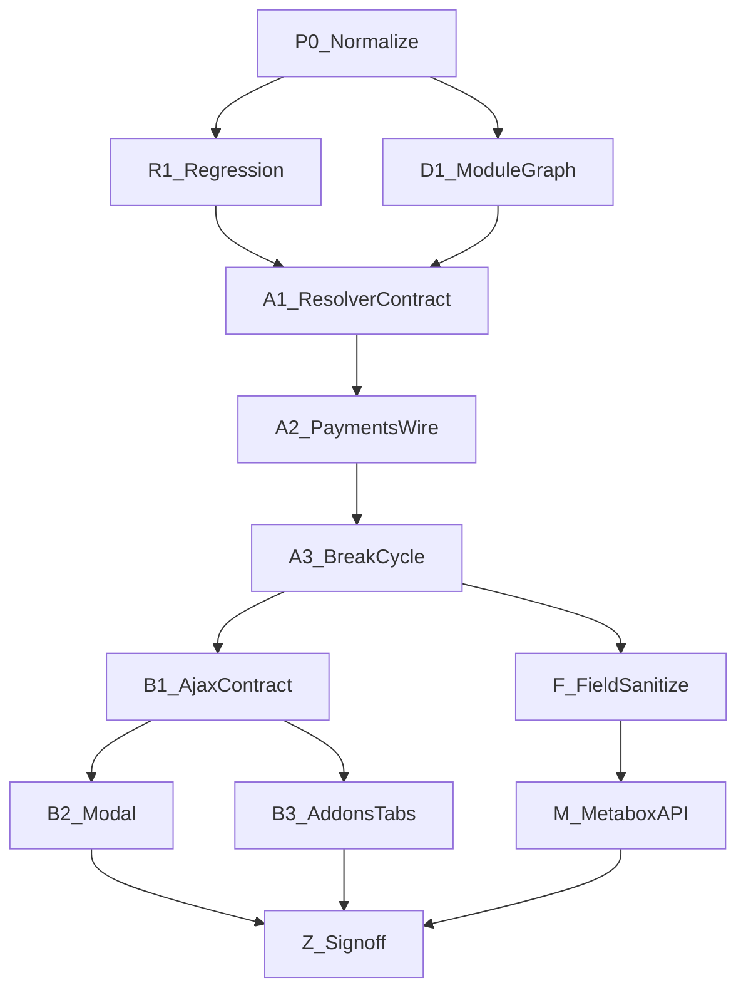

# WPDev Execution DAG

## Critical path

1. P0 → R1 + D1 (parallel)
2. A1 → A2 → A3 (break cycle before trusting full graph in production)
3. B1 → B2, B3
4. F → M
5. Z (all blockers green)

## Release blockers

R1, D1, A1–A3, B1, B3, F-01, M-01, M-03, Z2.

## Non-blockers (deferrable)

S-01 full settings monolith split, W-02 widget domain move, T-02/T-03 reference migrations beyond parity tests.
