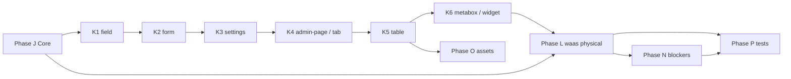

# Phase 2 Execution Plan — Completing WPDev Modularization

> Version: 2.5.0-target · Date: 2026-05-28  
> Basis: Codebase scan after Phase 1 (2.4.0) + master plan `wpdev_modularization_3fa91a41.plan.md`  
> **This document does not replace the Phase 1 plan** — it only covers **remaining** work.

> **2.5.0 update (in progress):** The models + database layer was physically moved to `modules/core` and `wpdev-*`; `Tax`, `License`, `Base_Manager` were shimmed; PHPUnit 5 tests.

---

## 1. Current State (Baseline 2.4.0 → 2.5.0 in progress)

### Completed

| Layer | Status |
|------|--------|
| `modules/core` | `Module_Loader`, `Service_Registry`, 6 service wrappers, `functions-module-managers.php` |
| Ajax (physical) | `modules/core/src/ajax/*` + shim in `inc/class-ajax.php` and … |
| Field / Form (physical) | `field-builder/src`, `form-builder/src` + shim in `inc/ui/` |
| 9 Builders | `setup.php` + `Component_Registry` + `class_alias` (no body migration) |
| 17 `wpdev-*` | Registration of `inc/Admin_Pages` pages on `wpdev_admin_pages` |
| Monolith pages | `wpdev_load_monolith_admin_pages` default `false` |
| Documentation | `docs/modularization/*` (16 inventory/contract files) |
| Partial blockers | REST slug checkout, table id collision, ajax abort in JS |

### Still canonical in `inc/`

| Path | Approx. count | Notes |
|------|--------------|---------|
| `inc/admin-pages/` | 51 classes | Only samples in `modules/admin-*`, `wizard` |
| `inc/list-tables/` | 28 classes | `Base_List_Table` + 2.4 ajax registry |
| `inc/ui/` | shim only | Field/Form/Tours + 20 elements → modules (K1-007 **done**) |
| `inc/managers/` | 24 managers | `Form_Manager` lazy; outside `load_managers()` |
| `views/` | colocated in modules + fallback `views/` | `views-module-map.md` |
| JS | `list-tables.js`, `wubox.js`, `tours.js`, … | No modular bundling |

### Core services that still delegate to `inc/`

- `Form_Service` → `Form_Manager`
- `Modal_Service` → `Form_Manager` + `wubox`
- `Tour_Service` → `UI\Tours`
- `View_Service` → `wpdev_get_template()`
- `Screen_Options_Service` → scaffold; `register()` not called anywhere

### Subsystems without a `wpdev-*` module

- ~~`inc/tax/`, `inc/rollback/`, `inc/debug/`, `inc/site-templates/`~~ → shim + canonical in `wpdev-*` (phase M)

---

## 2. Phase 2 Goals (Definition of Done)

1. **No new builder/domain classes** are included directly from `inc/*` (except temporary shims with an expiry date).
2. **Core services** have real implementations in `modules/core/src` (not wrappers only).
3. **Each builder** has at least: `setup.php` + `README` + `examples/example-01.php` + `examples/example-02.php` + documented manual test.
4. **Each `wpdev-*`** has at least: `src/` with Manager hooks + page registration + README old→new mapping.
5. **10 reference pages** without regression (UI + ajax + capability + multisite smoke).
6. **`class-alias-matrix.md`** and `migration-guide.md` are updated for every migration.
7. **PHPUnit** at minimum for: `Module_Loader` sort, `Ajax::register_list_table`, sample Field sanitize.

---

## 3. Migration Strategy (fixed pattern)

For each class `WPDevFramework\Foo\Bar` in `inc/`:

```
1. Copy/move to modules/{module}/src/.../class-bar.php (same namespace or new namespace + alias)
2. inc/.../class-bar.php → require_once shim (one line)
3. Update legacy-aliases.php if new namespace
4. Update autoload: Module_Autoloader map if new namespace
5. Test dependent page/endpoint
6. Remove shim only when no direct references to inc remain (phase 2.9)
```

**Dependency rule:** A domain module depends only on `core` + builders declared in `setup.php`; other domain managers are composed via hooks/`wpdev_load`.

---

## 4. Phase J — Completing Core (`modules/core`)

| ID | Task | `inc/` reference | Output | Priority |
|----|------|-------------|--------|--------|
| J-001 | Move `Form_Manager` to `modules/core/src/form/class-form-manager.php` | `inc/managers/class-form-manager.php` | Boot from `Form_Service`; remove opaque lazy load | P0 |
| J-002 | Decouple License from `Form_Manager` constructor (`License_Gate` interface) | **Done:** `License_Gate`, `wpdev_license_gate()`, `wpdev_register_forms` | Test without License active | P0 |
| J-003 | Move `UI\Tours` + glue to `modules/core/src/tour/` | `inc/ui/class-tours.php`, `assets/js/tours.js` enqueue in service | Native `Tour_Service` | P1 |
| J-004 | Extract view helpers to `modules/core/src/view/` | `inc/functions/template.php` (or equivalent) | `wpdev_view()` canonical | P1 |
| J-005 | `Screen_Options_Service::register()` — integrated with list/admin | `List_Admin_Page`, `Base_List_Table` | Remove duplicate `per_page` | P0 |
| J-006 | Standard ajax/json error contract | `class-ajax.php`, list ajax | `wp_send_json_*` + error code | P1 |
| J-007 | Nonce policy document + audit all `wp_ajax_*` | `ajax-inventory.md` | Security checklist | P1 |
| J-008 | Capability helper `wpdev_user_can( $cap, $context )` | Scattered `current_user_can` | `modules/core/src/capabilities.php` | P2 |
| J-009 | Remove duplicate ajax boot from `class-wpdev.php::load_extra_components` when service is active | `inc/class-wpdev.php` ~529–544 | Single boot path | P1 |
| J-010 | `Async_Calls` registry → public service method | `class-async-calls.php` | Documented API | P2 |

**Phase J acceptance:** `wpdev_services('form'|'modal'|'tour'|'view'|'screen_options')` without direct require of `inc/managers` or `inc/ui` for Tours.

---

## 5. Phase K — Builders (completing D–F)

### K1 — field-builder (completing D)

| ID | Task |
|----|------|
| K1-001 | Move admin field templates to `modules/field-builder/templates/admin/` |
| K1-002 | Move settings templates + legacy bridge (`v2_settings` filters) |
| K1-003 | `Field_Type_Registry` + sanitize contract per type |
| K1-004 | validation hooks: `wpdev_field_validate_{$type}` |
| K1-005 | ajax-model field provider (`type=model`, selectizer) |
| K1-006 | `examples/example-01-text-field.php`, `example-02-model-field.php` |
| K1-007 | Migrate 21 UI element classes — **done** (`admin-widget-builder`, `wpdev-checkout`, `wpdev-customer-panel`) |

### K2 — form-builder (completing D)

| ID | Task |
|----|------|
| K2-001 | Form DSL doc: fields/views/state/handlers |
| K2-002 | Consolidate `wpdev_register_form` only from `Form_Service` |
| K2-003 | modal submit/display from `Modal_Service`, not direct `Form_Manager` |
| K2-004 | examples: modal form + bulk confirm form |

### K3 — settings-panel-builder (completing D)

| ID | Task |
|----|------|
| K3-001 | Move `Settings` from `modules/admin-setting-page/Settings.php` → `settings-panel-builder/src` |
| K3-002 | section registry + side panels |
| K3-003 | save pipeline + toggle edge cases |
| K3-004 | `Settings_Admin_Page` from `Wizard_Admin_Page` — depends on K4 |

### K4 — menu-builder + admin-page-builder + tab-navigation (completing E)

| ID | Task |
|----|------|
| K4-001 | Extract menu API from `Base_Admin_Page` → `Menu_Registry` |
| K4-002 | Page template registry: dash, settings, list, edit, wizard, addons, centered, **custom** |
| K4-003 | Document lifecycle hooks: `wpdev_admin_page_{$id}_*` |
| K4-004 | Shared `Tab_Navigation` partial (list views / wizard ?tab / metabox tabs) |
| K4-005 | template `addons-ajax-tabs` for `Addons_Admin_Page` |
| K4-006 | examples: custom page callback + wizard tabs |

### K5 — table-builder (completing F)

| ID | Task |
|----|------|
| K5-001 | Move `Base_List_Table` to `modules/table-builder/src/` |
| K5-002 | declarative config: columns, actions, views, empty state |
| K5-003 | bulk pipeline → table config + `Modal_Service` |
| K5-004 | Migrate 27 concrete list tables (or keep inc with extends until phase L) |
| K5-005 | `list-tables.js`: scoping with `data-table-id` on `#wpdev-{id}` (verify after ajax_table_id) |
| K5-006 | override `user_can_ajax_refresh()` on customer-panel tables |
| K5-007 | examples: list page + widget list table |

### K6 — metabox-builder + admin-widget-builder (completing F)

| ID | Task |
|----|------|
| K6-001 | Extract widget API from `Edit_Admin_Page` (`add_fields_widget`, `add_tabs_widget`, …) |
| K6-002 | **Converge `Post_Edit_Admin_Page` with `Edit_Admin_Page`** via trait `Edit_Page_Widgets` |
| K6-003 | `widget-tabs`, `widget-list-table`, `widget-save` partials in `modules/metabox-builder/views/` |
| K6-004 | dashboard widgets: separate WP core vs WPDev (`admin-custom-page/views/dashboard-statistics/`) |
| K6-005 | `admin-widget-builder` datasource callback contract (no direct manager import) |

**Suggested order:** K1 → K2 → K3 → K4 → K5 → K6 (Settings and Wizard before settings page).

---

## 6. Phase L — Physical Domain Extraction (`wpdev-*`)

Each module below with target structure:

```
examples/{domain}/
  setup.php
  README.md          # mapping inc → module
  src/
    Admin/           # List/Edit pages (moved from inc/admin-pages)
    Tables/          # List tables
    Manager/         # thin wrapper or re-export manager
  views/             # override via View_Service
```

| ID | Module | Dependencies | Key classes to migrate | Notes |
|----|--------|---------|---------------------------|---------|
| L-001 | wpdev-events | core, table, admin-page | Event_List, Event_View, Event_Manager hooks | hub audit |
| L-002 | wpdev-customers | + metabox | Customer_* | |
| L-003 | wpdev-products | + tab (views) | Product_* — **tabs from `Product_List_Table::get_views()`** | |
| L-004 | wpdev-memberships | products, customers | Membership_* | |
| L-005 | wpdev-gateways | memberships | Gateway_Manager only in this module (remove duplicate `load_managers`) | |
| L-006 | wpdev-payments | memberships, gateways, field | Payment_* + ajax product field | |
| L-007 | wpdev-sites | customers | Site_* | multisite |
| L-008 | wpdev-domains | sites, wizard/sunrise | Domain_* | sunrise in wizard |
| L-009 | wpdev-checkout | form, field, tab | Checkout_* + **Signup_Fields_Manager** → submodule | REST test |
| L-010 | wpdev-emails | events | Email_*, template customize pages | |
| L-011 | wpdev-broadcasts | table | Broadcast_* | |
| L-012 | wpdev-webhooks | events | Webhook_* | |
| L-013 | wpdev-taxes | dashboard | `inc/tax/*` → module | |
| L-014 | wpdev-discount-codes | products | Discount_* | |
| L-015 | wpdev-customer-panel | widget, metabox | Customer_Panel/* + UI elements | separate capability |
| L-016 | wpdev-system | admin-page | Jobs, System_Info, Shortcodes, View_Logs, Hosting wizard | |
| L-017 | wpdev-addons | admin-page | Addons (priority 100) | lazy ajax tabs |
| L-018 | — | — | Remove monolith block entirely in `class-wpdev.php` (keep rollback filter) | **Done** — `modules/core/src/legacy/load-monolith-admin-pages.php` |

**Acceptance per L-00x:** Module page(s) are instantiated only from `examples/*`; `inc/admin-pages/class-{domain}*` shim or removed.

---

## 7. Phase M — Scattered Subsystems

| ID | Task | Suggested module |
|----|------|----------------|
| M-001 | `inc/tax/` → merge into `wpdev-taxes` | **Done** (`Tax` + `Dashboard_Taxes_Tab`) |
| M-002 | `inc/rollback/` → `wpdev-system` | **Done** (+ admin page; early boot in `WPDev::init`) |
| M-003 | `inc/debug/` → `wpdev-system` | **Done** (boot `wpdev_load`; internal `should_load()`) |
| M-004 | `inc/site-templates/placeholders` → `wpdev-sites` | **Done** |
| M-005 | Database layer (`inc/database/`) | **Done** — engine/posts in `core`; domain in `wpdev-*` + shim |

---

## 8. Phase N — Blockers and Hardening

| ID | Topic | Action | Test |
|----|--------|-------|-----|
| N-001 | Form_Manager / License | `License_Gate` + explicit boot in `wpdev_register_forms` | bulk form without license |
| N-002 | Checkout REST | verify `checkout_form` + integration test `GET /wp-json/.../checkout_form` | Postman / wp cli |
| N-003 | Table id | audit all `set_context('widget')` + customer-panel tables | customer edit |
| N-004 | Screen options duplicate | single path: either List_Admin_Page or Base_List_Table | settings + products list |
| N-005 | Capability registry | map caps from `$supported_panels` → `Capability_Registry` | 10 reference pages |
| N-006 | Gateway_Manager double init | only `wpdev-gateways` or only `load_managers` | |
| N-007 | Customer-panel ajax caps | override `user_can_ajax_refresh` on Invoice/Site tables | panel user |
| N-008 | Post_Edit vs Edit | shared trait `Edit_Object_Page` | metabox-post-type example — **done** |

---

## 9. Phase O — Modular JS / Assets

| ID | Task |
|----|------|
| O-001 | `wpdev_enqueue_module_script` + `wpdev_get_module_asset_url` | **Done** |
| O-002 | `list-tables.js` → `table-builder/assets/js/` | **Done** |
| O-003 | `wubox.js` → `core/assets/js/` | **Done** |
| O-004 | `tours.js` → `core/assets/js/` | **Done** |
| O-005 | `selectizer`, `vue-apps` → `field-builder/assets/js/` | **Done** |

---

## 10. Phase P — Testing and Acceptance

### P1 — PHPUnit (new)

| ID | Task |
|----|------|
| P-001 | `phpunit.xml` + bootstrap from `plugin-core-test` |
| P-002 | `Module_Loader_Test` — topological sort + circular deps |
| P-003 | `Ajax_Table_Registry_Test` |
| P-004 | `Field_Sanitize_Test` (sample per type) | **Done** (text + number min) |
| P-005 | `Checkout_Rest_Route_Test` | **Done** |

### P2 — Manual regression (from `regression-checklist.md`)

Reference pages (required before tag 2.5.0):

1. `admin.php?page=wpdev`
2. `admin.php?page=wpdev-settings`
3. `admin.php?page=wpdev-products`
4. `admin.php?page=wpdev-domains`
5. `admin.php?page=wpdev-broadcasts`
6. `admin.php?page=wpdev-payments`
7. `admin.php?page=wpdev-checkout-forms`
8. `admin.php?page=wpdev-edit-checkout-form`
9. `admin.php?page=wpdev-edit-product`
10. `admin.php?page=wpdev-addons`

+ multisite: network admin, sunrise path, setup wizard requirements.

### P3 — Performance

- list ajax: no double-fetch (confirm abort)
- dashboard: no duplicate script handles
- `wpdev_modules_loaded` — load time < baseline ±10%

---

## 11. Execution Dependency Matrix (summary)



**Critical path:** J-001/J-005 → K5-001 → L-009 (checkout) → N-002 → P2.

---

## 12. Volume Estimate (for planning)

| Phase | Approx. tasks | Risk |
|-----|------------|------|
| J | 10 | Medium — Form_Manager/License |
| K | 35 | High — Settings/Wizard/Post_Edit |
| L | 18 modules | High — 51 admin pages + 28 tables |
| M | 5 | Low |
| N | 8 | Medium |
| O | 5 | Low |
| P | 8+ | Medium — requires WP environment |

**Realistic total:** 2–4 sprints for a 1-person team (depending on depth of physical L migration).

---

## 13. Risks

| Risk | mitigation |
|------|------------|
| Broken ajax/forms after Form_Manager move | feature flag `wpdev_use_core_form_service`; rollback shim |
| Duplicate hooks after waas + monolith | keep `wpdev_load_monolith_admin_pages` until end of L-018 |
| Breaking namespace for third-party add-ons | `class_alias` for at least 2 versions; deprecation in `changelog` |
| No historical PHPUnit | start from P-001 in parallel with J-001 |
| Breaking view paths | `View_Service::locate()` module paths |

---

## 14. Documentation Deliverables (per phase)

- Update `class-alias-matrix.md`
- Update `migration-guide.md` + `changelog.md`
- README for each touched module
- `bin/generate-modularization-docs.php` — regenerate inventories after L-018

---

## 15. Quick-Start Checklist (first week)

- [x] J-001 Form_Manager to core
- [x] J-005 Screen options integrated
- [x] K5-001 Base_List_Table to table-builder
- [x] N-002 REST checkout verify (PHPUnit)
- [x] P-001 phpunit scaffold
- [ ] Run 10-page regression (manual — requires network admin login)
- [x] `composer smoke` for shim/assets/views
- [x] WP bootstrap regression (`bin/regression-wp-load.php` in Docker)

---

## 16. Differences from Phase 1 Plan

| Topic | Phase 1 | Phase 2 (this document) |
|--------|-------|------------------|
| Focus | skeleton + registration | **class bodies + views + JS** |
| wpdev-* | setup only | `src/` + inc migration |
| Builders | Component_Registry | registry + **real classes** |
| DoD | loader works | 10 pages + baseline PHPUnit |
| inc/ | canonical | shim → gradual removal |

---

*For inventory details, see `docs/modularization/*-inventory.md`.*
