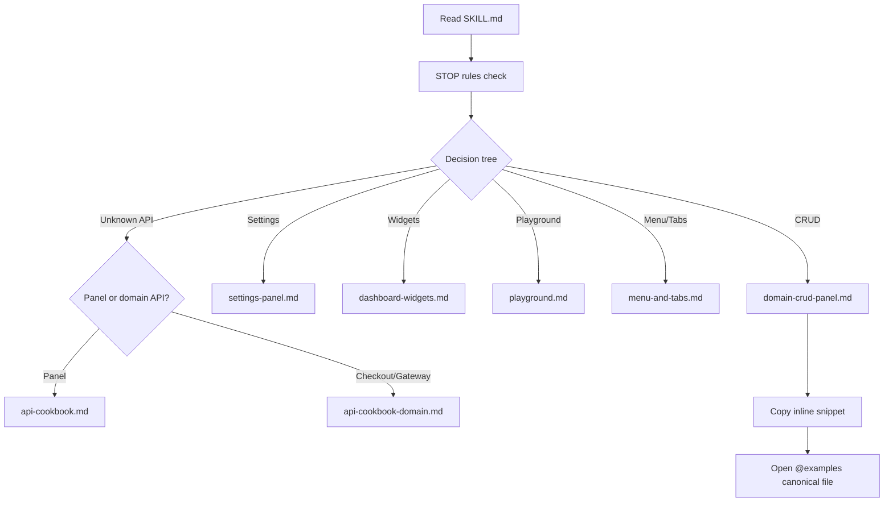

# بازنویسی skill wpdev-panel-builder (پلن نهایی — پس از review)

## خلاصه اجرایی

Skill فعلی در [`skills/wpdev-panel-builder/`](skills/wpdev-panel-builder/) (۱۳ فایل، ~۱.۴K خط) **اسکلت درستی دارد** اما برای agent ضعیف و الزام «همه API با مثال» **ناقص و متناقض** است. این پلن بازنویسی کامل را با تصمیم‌های ثبت‌شده شما تعریف می‌کند.

### تصمیم‌های شما (نهایی)

| موضوع | انتخاب |
|-------|--------|
| API scope | دو لایه: `SKILL.md` (ضروری) + cookbook تقسیم‌شده |
| Cookbook split | `api-cookbook.md` (panel) + `api-cookbook-domain.md` (checkout/gateway/events) |
| Example strategy | snippet کامل inline + ارجاع به فایل اصلی |
| زبان | **English only** (همه فایل‌های skill) |
| مسیرها | نسبی از skill root — **بدون absolute path** |

---

## امتیازدهی skill فعلی در برابر الزامات

| الزام | وضعیت | نمره |
|-------|--------|------|
| دقت و کامل بودن | تناقض مسیر `examples/` vs `wpdev-examples/`؛ playground در layout اشتباه | ۴/۱۰ |
| Best practices (Cursor skill) | progressive disclosure خوب؛ SKILL.md بدون STOP rules | ۶/۱۰ |
| بهینه برای agent ضعیف | بدون decision tree صریح؛ بدون anti-patterns | ۵/۱۰ |
| همه API با مثال | ~۲۰ از ~۱۰۰ `wpdev_*` دارای snippet | ۳/۱۰ |
| ارجاع playground + examples | جزئی در examples-map؛ ناقص برای ۱۳ ماژول | ۶/۱۰ |
| مسیرهای نسبی | absolute path ندارد ✓؛ اما alias یکپارچه ندارد | ۷/۱۰ |

---

## مشکلات بحرانی (باید در فاز ۱ رفع شوند)

### ۱. تناقض مسیر examples

- [`SKILL.md`](skills/wpdev-panel-builder/SKILL.md) و [`examples-map.md`](skills/wpdev-panel-builder/references/examples-map.md) → `wpdev-examples/`
- ۸ فایل دیگر → `examples/` (convention داخل [`docs/api/manifest.json`](docs/api/manifest.json))
- **راه‌حل:** alias `@examples` = `../../../wpdev-examples/` در همه فایل‌ها؛ در cookbook یادداشت: `manifest "examples/foo" = @examples/foo`

### ۲. playground در جای اشتباه

[`domain-crud-panel.md`](skills/wpdev-panel-builder/references/domain-crud-panel.md) خطوط ۱۸–۲۰ و ۲۴۱–۲۷۱:
- layout شامل `playground.php` داخل `examples/{slug}/`
- checklist: «Optional: playground.php»

**واقعیت:** playground فقط در `@playground/playground-{module}/playground.php` ([`playground.md`](skills/wpdev-panel-builder/references/playground.md)، [`docs/framework/README.md`](docs/framework/README.md)).

**راه‌حل:** حذف `playground.php` از directory layout؛ بخش جدا با لینک به `playground.md`.

### ۳. ارجاع‌های شکسته/منسوخ

| ارجاع | فایل | جایگزین |
|-------|------|---------|
| `composer docs:api-*` | `finding-apis.md` | `rg` روی `@framework/docs/api/manifest.json` |
| `examples/wpdev-playground-sample/` | `settings-panel.md` | `@playground/playground-settings-panel-builder/` |
| `wpdev/examples/` | `playground.md` L14 | حذف — فقط `@playground/` |

### ۴. ماژول‌های بدون reference اختصاصی

از ۱۳ ماژول framework، skill فقط به‌صورت غیرمستقیم پوشش می‌دهد:

| ماژول | وضعیت فعلی | اقدام |
|-------|-----------|-------|
| `menu-builder` | فقط جدول در finding-apis | `menu-and-tabs.md` |
| `tab-navigation` | — | `menu-and-tabs.md` |
| `admin-custom-page` | اشاره در dashboard-widgets | `custom-and-setting-pages.md` |
| `admin-setting-page` | اشاره در settings-panel | `custom-and-setting-pages.md` |
| `wizard` | — | `wizard.md` |
| `metabox-builder` | بخشی در fields-and-widgets | گسترش + cookbook entries |

### ۵. API بدون snippet

از [`manifest.json`](docs/api/manifest.json): **۱۰۰ نماد `wpdev_*`**.

پوشش فعلی skill (تخمینی):

| دسته | تعداد manifest | snippet در skill |
|------|---------------|------------------|
| `wpdev_register_*` | ~۴۵ | ~۱۸ |
| lifecycle hooks | ~۱۰ | ~۴ (جدول بدون snippet) |
| getters/savers | ~۱۵ | ~۳ |
| ajax/modal helpers | ~۱۰ | ~۵ |
| domain (checkout/gateway) | ~۲۰ | ~۰ |

---

## قرارداد مسیر (الزام)

در ابتدای [`SKILL.md`](skills/wpdev-panel-builder/SKILL.md):

```markdown
## Path legend (always use these — never absolute paths)

| Alias | Relative from this skill | Resolves to |
|-------|--------------------------|-------------|
| `@framework` | `../../` | wpdev plugin root (modules/, docs/) |
| `@examples` | `../../../wpdev-examples/` | WaaS sibling plugin (full examples) |
| `@playground` | `../../../wpdev-playground/` | Playground sibling plugin (minimal demos) |

Manifest logical path `examples/{slug}/` = `@examples/{slug}/`.
```

**قوانین:**
- لینک‌های markdown داخل skill: `[text](../../modules/...)` یا alias در prose
- grep recipes: `rg 'pattern' ../../` از skill root
- هیچ `/Users/...`، `wp-content/plugins/wpdev/...`

---

## ساختار نهایی فایل‌ها

```
skills/wpdev-panel-builder/
├── SKILL.md                              # ≤200 lines, English, entry point
└── references/
    ├── api-cookbook.md                   # NEW — panel APIs (~80 symbols)
    ├── api-cookbook-domain.md            # NEW — domain APIs (~20 symbols)
    ├── anti-patterns.md                  # NEW
    ├── playground-index.md               # NEW — full module↔playground table
    ├── examples-map.md                   # REWRITE
    ├── finding-apis.md                   # FIX
    ├── domain-crud-panel.md              # FIX
    ├── admin-pages.md                    # FIX paths + snippets
    ├── list-tables.md
    ├── fields-and-widgets.md
    ├── dashboard-widgets.md
    ├── settings-panel.md
    ├── playground.md
    ├── model-db-manager.md
    ├── example-types.md
    ├── ui-polish.md
    ├── menu-and-tabs.md                  # NEW
    ├── custom-and-setting-pages.md       # NEW
    └── wizard.md                         # NEW
```



---

## بازنویسی `SKILL.md` (لایه ۱)

**زبان:** English only. **حداکثر:** ۲۰۰ خط.

### بخش ۱ — STOP rules (قبل از هر کد)

```
NEVER guess a function signature — check api-cookbook.md or @framework/docs/api/manifest.json
NEVER add PHP under inc/
NEVER create wpdev-examples/wpdev-{slug}/ folders
NEVER put playground panels inside wpdev-examples/
NEVER require non-API files from modules/
ALWAYS check wpdev_example_is_loaded( 'wpdev-{slug}' ) before cross-example calls
ALWAYS use module id wpdev-{slug} in registration APIs, folder slug {slug} in wpdev-examples/
```

### بخش ۲ — Decision tree (۵ سوال)

| # | Question | Yes → | No → |
|---|----------|-------|------|
| 1 | Need DB + list + edit + manager? | `domain-crud-panel.md` | Q2 |
| 2 | Settings section/fields only? | `settings-panel.md` | Q3 |
| 3 | Dashboard KPI/stat widgets? | `dashboard-widgets.md` | Q4 |
| 4 | Dev sandbox/demo panel? | `playground.md` | Q5 |
| 5 | Checkout/gateway/payment flow? | `api-cookbook-domain.md` + `@examples/checkout/` | `examples-map.md` |

### بخش ۳ — Panel type table (موجود — به‌روز با لینک‌های جدید)

### بخش ۴ — Essential APIs (~۳۵) با inline snippet

هر entry: **Signature → When to use → Snippet (5–20 lines) → Full example path**

| API group | Functions |
|-----------|-----------|
| Lifecycle | `wpdev_on_load`, `wpdev_on_admin_pages`, hooks table |
| Module boot | `Module_Loader::register`, `wpdev_boot_module_manager`, `wpdev_require_public_function` |
| Pages | `wpdev_register_module_admin_pages`, `wpdev_register_admin_page` |
| Storage | `wpdev_register_table` |
| List UI | instantiate `Base_List_Table` in `table()` |
| Edit UI | `add_fields_widget`, `add_tabs_widget`, `add_list_table_widget` |
| Fields/Forms | `wpdev_register_field_type`, `wpdev_register_form`, `wpdev_modal_open`, `wpdev_register_ajax_modal` |
| Settings | `wpdev_register_settings_section`, `wpdev_register_settings_field`, `wpdev_get_setting` |
| Widgets | `wpdev_register_dashboard_widget` |
| Ajax | `wpdev_register_ajax_handler`, `wpdev_ajax_success`, `wpdev_ajax_error` |
| Playground | `wpdev_register_playground_panel`, `wpdev_playground_list_panel` |
| Menu | `wpdev_register_menu_top`, `wpdev_register_menu_child` |
| Views | `wpdev_register_module_views` |
| Metabox | `wpdev_register_metabox` |
| Soft deps | `wpdev_example_is_loaded`, `wpdev_module_is_loaded` |

### بخش ۵ — Two-tier example strategy

| Tier | Plugin | Use for | Canonical path |
|------|--------|---------|----------------|
| **Minimal** | `@playground` | Learn one API in isolation; smoke test | `@playground/playground-{module}/playground.php` |
| **Full** | `@examples` | Production WaaS pattern to copy | `@examples/products/` (CRUD gold standard) |

### بخش ۶ — Quality checklist + link to `anti-patterns.md`

### بخش ۷ — Additional resources (همه با alias)

---

## `api-cookbook.md` — panel APIs (~۸۰ نماد)

**Entry template (ثابت برای agent ضعیف):**

```markdown
### wpdev_register_form

| Field | Value |
|-------|-------|
| Module | form-builder |
| Signature | `wpdev_register_form( string $form_id, array $atts = array() )` |
| Hook | `wpdev_load` or page `register_forms()` |
| When | Ajax modal form on edit page |
| Playground | `@playground/playground-form-builder/playground.php` |
| Full example | `@examples/checkout/setup.php` |
| Doc | `@framework/modules/form-builder/API_DOC.md` |

```php
// Minimal example
wpdev_register_form( 'add_note', array(
    'title'   => __( 'Add Note', 'wpdev' ),
    'fields'  => array( /* ... */ ),
    'handler' => array( $this, 'handle_add_note' ),
) );
```
```

### گروه‌بندی

| Section | Symbols | Snippet source priority |
|---------|---------|------------------------|
| A. Registry facades | all `wpdev_register_*` (panel) | `@framework/modules/*/examples/example-01.php` → `@examples/products/setup.php` → `@playground/playground-*/` |
| B. Lifecycle hooks | `wpdev_init`, `wpdev_load`, `wpdev_admin_pages`, `wpdev_register_forms`, `wpdev_modules_loaded` | `@framework/docs/framework/README.md` |
| C. Getters/savers | `wpdev_get_*`, `wpdev_save_*`, `wpdev_get_setting` | `@examples/admin-setting-page-defaults/` |
| D. Ajax/modal | `wpdev_modal_open`, `wpdev_ajax_*`, `wpdev_register_ajax_tabs` | `@examples/checkout/`, `@framework/modules/form-builder/examples/` |
| E. Base classes | `List_Admin_Page`, `Edit_Admin_Page`, `Base_List_Table`, `Base_Model`, `Table` | signature + minimal extend snippet |
| F. Playground helpers | `wpdev_playground_list_panel`, `wpdev_render_settings_panel_playground` | `@playground/playground-wpdev/` |

نمادهای `status: missing` در manifest → برچسب `VERIFY_IN_SOURCE` + snippet از فایل PHP منبع.

---

## `api-cookbook-domain.md` — domain APIs (~۲۰ نماد)

فقط وقتی agent روی checkout/payment/gateway/events کار می‌کند:

| Section | APIs | Full example |
|---------|------|--------------|
| Checkout | `wpdev_register_checkout_field_type`, checkout form helpers | `@examples/checkout/` |
| Gateways | `wpdev_register_gateway`, `wpdev_register_gateways` | `@examples/gateways/` |
| Events | `wpdev_register_event_type`, `wpdev_register_all_events` | `@examples/events/` |
| Widget datasources | `wpdev_register_widget_datasource` | `@examples/checkout/`, `@examples/admin-custom-page-dashboard-widgets/` |
| Jumper | `wpdev_register_jumper_command`, `wpdev_register_jumper_namespace` | `@examples/dashboard/` |
| Migration | `wpdev_register_migration` | `@examples/*/setup.php` deprecated shims |

هر entry همان template ثابت + snippet inline.

---

## `playground-index.md` (جدول کامل — از docs/framework/README.md)

| Framework module | Playground panel | Admin URL | Acceptance markers | WaaS example |
|-----------------|------------------|-----------|-------------------|--------------|
| field-builder | `@playground/playground-field-builder/` | `?page=wpdev-pg-field-builder` | ... | `@examples/products/` |
| form-builder | `@playground/playground-form-builder/` | ... | ... | `@examples/checkout/` |
| ... (all 13 modules) | ... | ... | ... | ... |

Extra: `@playground/playground-wpdev/` (WaaS list preview), `@playground/playground-metabox-post-type/`.

---

## `anti-patterns.md` (برای agent ضعیف)

| # | Never do this | Do this instead | Why |
|---|--------------|-----------------|-----|
| 1 | `modules/wpdev-products/` | `@examples/products/` in sibling plugin | Layer separation |
| 2 | `wpdev_register_list_table()` for domain CRUD | `new My_List_Table()` in `table()` | products pattern |
| 3 | `playground.php` in `@examples/{slug}/` | `@playground/playground-{module}/` | Boot contract |
| 4 | Guess `wpdev_register_*` signature | Read `api-cookbook.md` entry | Prevents fatal |
| 5 | `WPDev\` namespace in new code | `WPDevFramework\` (match surrounding file) | Autoloader |
| 6 | Call cross-example API without check | `wpdev_example_is_loaded()` guard | Soft dependency |
| 7 | `require` from `modules/*/src/` | Public `wpdev_*` facade only | API contract |
| 8 | Register widgets before `wpdev_load` | `add_action( 'wpdev_load', ... )` | Lifecycle |

---

## اصلاحات فایل‌به‌فایل (موجود)

| File | Changes |
|------|---------|
| `domain-crud-panel.md` | Remove `playground.php` from layout; `@examples/` paths; English; add inline snippets for setup/list/edit/table; fix namespace examples (`WPDevFramework\` not `WPDev\`) |
| `finding-apis.md` | Remove composer; add cookbook cross-links; expand register table; grep from skill root |
| `settings-panel.md` | Remove playground-sample; add full `wpdev_get_setting`/`wpdev_save_setting` snippets |
| `admin-pages.md` | Fix `examples/` paths; add `wpdev_register_admin_page` full snippet |
| `list-tables.md` | Fix paths; add bulk hook snippets |
| `fields-and-widgets.md` | Add `wpdev_register_ajax_modal` snippet; `wpdev_register_metabox` entry |
| `model-db-manager.md` | Fix namespace inconsistency (`WPDevFramework\Database\` not `WPDev\`); fix paths |
| `playground.md` | Link to `playground-index.md`; remove `wpdev/examples/` |
| `examples-map.md` | Add columns: playground panel, cookbook section, snippet location |
| `example-types.md` | Fix paths; add emails/addons references |
| `ui-polish.md` | Fix paths; add `wpdev_register_page_template` snippet |
| `dashboard-widgets.md` | Add `wpdev_register_widget_datasource` cross-link to domain cookbook |

---

## بهینه‌سازی agent ضعیف (چک‌لیست طراحی)

- [ ] SKILL.md ≤ ۲۰۰ خط — agent فقط یک فایل می‌خواند اول
- [ ] هر workflow = numbered steps + copy-paste checklist
- [ ] هر API = signature + when + snippet + where to copy full version
- [ ] Decision tree قبل از هر reference — agent گم نشود
- [ ] STOP rules در ۸ bullet — hallucination کم شود
- [ ] Two-tier examples (playground minimal / examples full) — agent بداند کجا شروع کند
- [ ] Cookbook entry template یکسان — agent بداند چه فیلدهایی انتظار دارد
- [ ] English only — consistency برای weak models
- [ ] Links یک سطح از SKILL.md — partial read نشود
- [ ] Frontmatter description: trigger terms گسترده‌تر

---

## اعتبارسنجی پس از اجرا

```bash
# Run from wpdev plugin root
rg '/Users/' skills/wpdev-panel-builder/                    # expect 0
rg 'composer docs:' skills/wpdev-panel-builder/             # expect 0
rg 'wpdev-playground-sample' skills/wpdev-panel-builder/     # expect 0
rg 'wpdev/examples/' skills/wpdev-panel-builder/            # expect 0
rg 'examples/' skills/wpdev-panel-builder/ --glob '!api-cookbook*.md'  # expect 0 (after migration)
wc -l skills/wpdev-panel-builder/SKILL.md                   # expect ≤200
```

**Coverage matrix** (دستی):

| Check | Target |
|-------|--------|
| Every `wpdev_register_*` in panel scope | entry in `api-cookbook.md` with snippet |
| Every framework module (13) | row in `playground-index.md` + reference file |
| Every existing reference file | zero `examples/` bare paths (use `@examples`) |
| CRUD scaffold | agent can follow SKILL.md + domain-crud-panel only |

---

## ترتیب اجرا

1. **Path legend + SKILL.md rewrite** (STOP, tree, essential APIs, English)
2. **api-cookbook.md** — panel symbols from manifest + module examples
3. **api-cookbook-domain.md** — checkout/gateway/events
4. **New refs:** anti-patterns, playground-index, menu-and-tabs, custom-and-setting-pages, wizard
5. **Fix ۱۲ existing references** — paths, snippets, remove broken refs
6. **Rewrite examples-map.md**
7. **Grep validation + coverage matrix**

---

## خارج از scope (عمداً)

- ایجاد symlink یا کپی `wpdev-examples`/`wpdev-playground` به داخل repo (sibling plugins ممکن است در checkout نباشند — skill با alias و inline snippet self-sufficient می‌شود)
- تغییر `docs/api/manifest.json` یا `API_DOC.md` ماژول‌ها
- انتقال skill به `.cursor/skills/` (فعلاً canonical path همان `skills/wpdev-panel-builder/` per [`docs/CONTEXT.md`](docs/CONTEXT.md))
